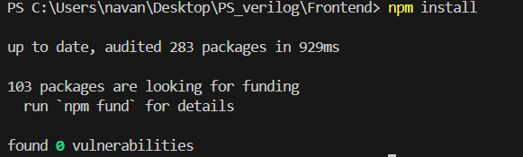
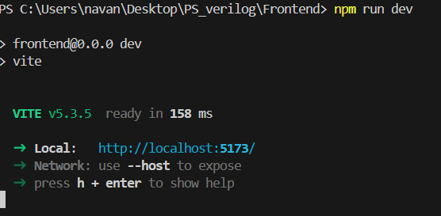
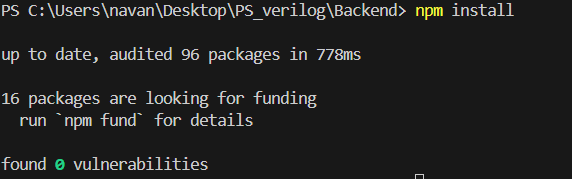
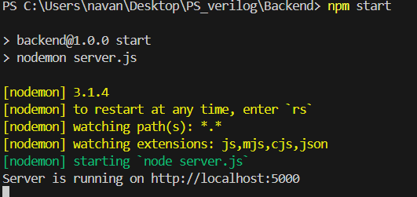
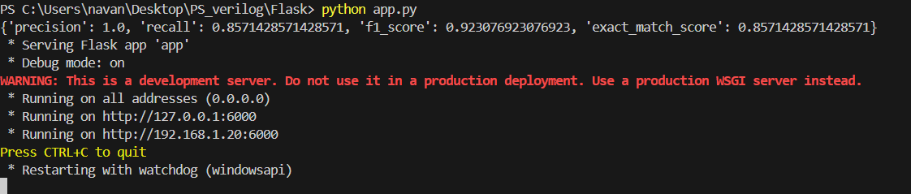

# LLMs for Automated Verilog RTL Code Generation

## Project Overview

### Title
LLMs for Automated Verilog RTL Code Generation

### Problem Statement
Verilog is a hardware description language to model and design digital systems. Generating Verilog code is the first step in automating hardware/chip design. The goal of this project is to fine-tune an LLM with Verilog datasets (collected from GitHub and Verilog textbooks) and test/use it in generating Verilog code for different chips. An attempt would be made to develop a test bench for testing the syntax of the so-generated Verilog code. The project involves the following steps:
1. Download datasets identified from the sources above.
2. Preprocess the data to identify relevant data.
3. Use the above clean data to fine-tune the open-source CodeGen LLM.
4. Use this LLM to generate Verilog code for different types of chips.
5. Develop a test bench for testing the syntax of the above-generated code.

### Category
GenAI / Semiconductor design

### Team Members
- Navanth
- Roshan
- Srujan
- Fayaz
- Sreeja
- Tanusha
- Khushiee

### Mentor
K. Ramakrishna

### Model and Dataset
- **LLM used:** [Salesforce/codegen-2B-multi](https://huggingface.co/Salesforce/codegen-2B-multi)
- **Dataset:** [emilgoh/verilog-dataset-v2](https://huggingface.co/datasets/emilgoh/verilog-dataset-v2)
- **Fine-tuning time:** 12 hours

### Fine-Tuning Details
We used PEFT and LoRA for fine-tuning with `max_steps=4000`.

## Instructions

### To run the frontend
Open cmd to the path for the frontend folder.
1. `npm install`
   
2. `npm run dev`
   

### To run the backend
Open cmd to the path for the backend folder.
1. `npm install`
   
2. `npm start`
   

### To run the Flask server
Open cmd to the path for the Flask folder.
1. `python app.py`
   
